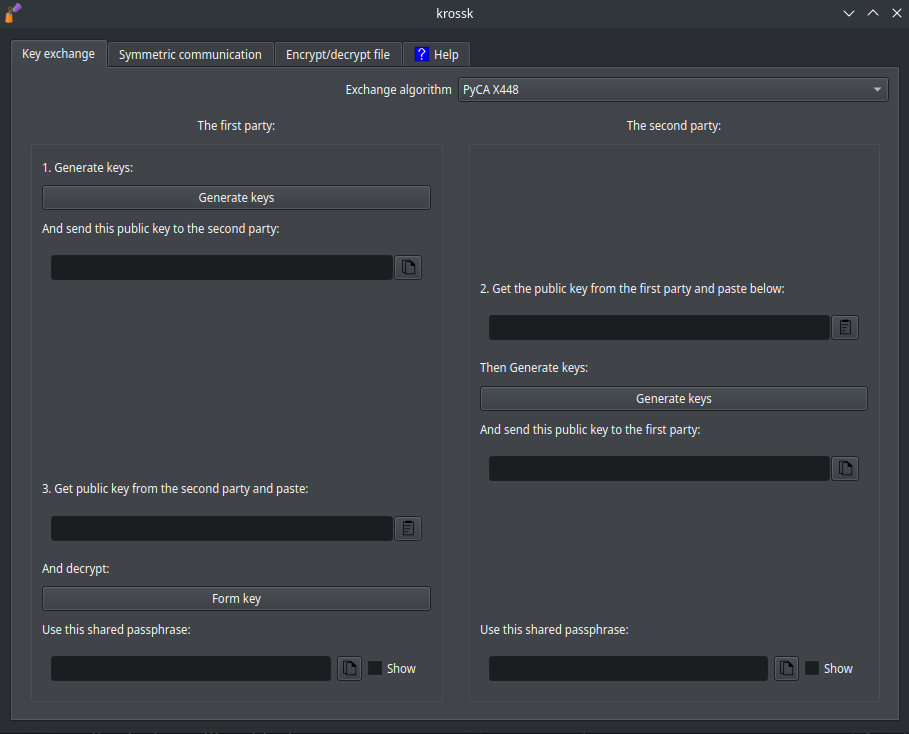

# krossk


Transfer encrypted messages CROSS unsafe messengers. 

English documentation can be viewed [here](./README_en.md).

# Зависимости

Если будет использоваться функционал [gpg](https://gnupg.org/), то нужно [установить gpg](https://gnupg.org/download/index.html).

- GNU/linux: 

- - Debian-like: `> sudo apt install gnupg`

- - Arch: `> sudo pacman -S gnupg`.

- Windows: [https://gpg4win.org/download.html](https://gpg4win.org/download.html).

Если `GPG` не работает, то скорее всего проблема с кодировкой windows. [Здесь решение: https://github.com/The220th/krossk/issues/1](https://github.com/The220th/krossk/issues/1).

Зависимости `Python`:

``` bash
> python -m ensurepip --upgrade # установка pip, если его нет

> pip install --upgrade pip
> pip install -r requirements.txt
```

# Компиляция одного исполняемого файла

``` bash
> git clone https://github.com/The220th/krossk
> cd krossk
> python -m venv new_venv

> source ./new_venv/bin/activate  # GNU/Linux
> .\new_venv\Scripts\activate.bat # Windows

> pip freeze > requirements_for_delete.txt
> pip uninstall -r requirements_for_delete.txt -y

> pip install --upgrade pip
> pip install -r requirements.txt
> pip install pyinstaller

> pyinstaller --onefile --paths=new_venv/lib64/python3.10/site-packages/:new_venv/lib/python3.10/site-packages/ krossk.py # GNU/Linux
> pyinstaller --onefile --paths=new_venv\Lib\site-packages --windowed krossk.py # Windows

# В директории dist будет лежать исполняемый файл
```

# Запуск

Либо скачайте исполняемый файл из [релизов](https://github.com/The220th/krossk/releases) и запустите его. 

Либо:

``` bash
# ~/.local/bin/ must be in PATH
> wget -qO- https://github.com/The220th/krossk/releases/download/V1.00/krossk-V1.01-linux-amd64.tar.gz | tar -C "$HOME/.local/bin/" -xvz
```

Или так:

``` bash
> git clone https://github.com/The220th/krossk
> cd krossk
> pip install -r requirements.txt
> python krossk.py
```

# Использование

Нужно сказать, что использование программы на свой страх и риск.

Предположим такую ситуацию:

Алиса и Боб хотят обменяться сообщениями через мессенджер. Причём они могут обмениваться сообщениями ТОЛЬКО через этот мессенджер (они не могут лично встретиться). Также Алиса и Боб знают, что каждое их сообщение читает Ева. Как Алисе и Бобу обмениваться сообщениями? Эта программа поможет решить эту проблему.

## Вкладка Key exchange



Чтобы Алиса и Боб могли шифровать сообщения, им нужен "общий пароль" или `passphrase`. Но `passphrase` нельзя написать в их мессенджер, так как Ева всё читает. Обмен ключами возможно сделать с помощью ассиметричного шифрования. 

В `krossk` для этого представлены 2 алгоритма `PyCA X448` и `kRSA4096`. 
- PyCA X448 позволяет обменяться ключами с помощью `Diffie-Hellman key exchange` на эллиптической кривой 448. 
- kRSA4096 - это имплементация RSA, которая тоже позволит обменяться `passphrase`. 

Код открыт и доступен:
- [PyCA X448](https://github.com/pyca/cryptography/blob/main/src/cryptography/hazmat/primitives/asymmetric/x448.py)
- [kRSA4096](https://github.com/The220th/krossk/blob/main/krossk_crypto/rsa4096.py)

Во вкладке `Key exchange` происходит обмен ключами. Участники обмена сообщениями (Алиса и Боб) делятся на 2 роли:
- `The first party`
- `The second party`

Каждый участник выбирает только 1 роль.

Обмен ключами состоит из трёх пунктов:

1. Генерация ключей участником `The first party`. Отправка ключей участнику `The second party`.

2. Получение ключей от `The first party`. Формирование ответа участником `The second party`. Отправка ответа участнику `The first party`.

3. Получение ответа от `The second party` и формирование общего ключа.

В программе во вкладке `Key exchange` эти пункты так и подписаны (1, 2, 3).

Пусть Алиса будет `The first party`, а Боб будет `The second party`. Все действия Алиса делает в левой части окна, а Боб - в правой. 

### Пункт 1

Алиса нажимает кнопку Generate keys. 

Алиса копирует получившийся публичный ключ и отправляет через мессенджер Бобу.

### Пункт 2

Боб получает публичный ключ от Алисы и вставляет в текстовое поле с публичным ключом. 

Если используется kRSA4096, то нужно ввести `генератор passphrase`. В этом случае рекомендуется нажать кнопку `Rnd`. 

Боб нажимает кнопку под вставленным публичным ключом и полученный текст ниже отправляет Алисе через мессенджер.

Также Боб получает в нижнем правом углу этот самый "общий пароль" или `passphrase`.

### Пункт 3

Алиса копирует то, что прислал Боб во втором пункте и вставляет это в третьем пункте внизу. 

Далее Алиса нажимает кнопку Form key и получает в нижнем левом углу "общий пароль" или `passphrase`. 

Если всё сделано верно, то у Алисы и Боба будет одинаковый `passphrase`. Этот одинаковый `passphrase` нужно будет использовать во вкладке `Symmetric communication`.

Попробуйте сначала принять на себя обе роли (`The first party` и `The second party`) и обменяться `passphrase` с самим собой.

Ева читала все сообщения, но она ничего с этим сделать не сможет (см. в гугле ассиметричное шифрование). Математика ей не позволит. Единственная адекватная возможность у Евы "взломать" сообщения - это менять ключи Алисы/Боба на свои. Это можно сделать только если Ева может менять сообщения в переписке в мессенджере. Эта уязвимость называется "человек посередине". Грубо говоря, если Боб точно знает, что переписывается с Алисой, а Алиса точно знает, что переписывается с Бобом, и при этом Ева не может менять их переписку, то "человек посередине" не страшен. 

Рядом с каждым полем с вводом данных/ключей/passphrase есть кнопки `копировать/вставить`. Также копировать можно с помощью `CTRL+C`, заранее выделив весь текст с помощью комбинации клавиш `CTRL+A`.
Вставлять скопированный текст можно с помощью `CTRL+V`.

## Вкладка Symmetric communication


Здесь происходит шифрование сообщений. 

Введите `passphrase`, полученный во вкладке "Key exchange". Такой же `passphrase` должен быть и у другой `стороны общения`.

`Сторона общения` - это персона, с которой происходит обмен зашифрованными сообщениями.

Если `passphrase` был обговорён заранее, например, при личной встрече, то введите этот заранее обговоренный `passphrase`. Главное, чтобы `passphrase` был одинаковый у сторон общения.

Правее можно выбрать алгоритм симметричного шифрования. В `krossk` доступны 4 варианта:
- [PyCA Fernet AES128-cbc](https://github.com/pyca/cryptography/blob/main/src/cryptography/fernet.py) `Fernet` - это [спецификация](https://github.com/fernet/spec/). 

- [GPG AES256](https://dev.gnupg.org/source/gnupg/). Программу `GPG` нужно установить отдельно. На Windows могут наблюдаться проблемы, связанные с кодировкой. 

- [GPG default](https://dev.gnupg.org/source/gnupg/). `GPG AES256` и `GPG default` отличаются только параметром `--s2k-cipher-algo`. В `GPG AES256` он равен `AES256`, а в `GPG default` он пустой.

- [kaes256CBC](https://github.com/The220th/py_AES256_cbc_implementation/blob/main/kaes256cipher.py).

Ещё правее можно будет посмотреть логи ("переписку"). Для этого нажмите кнопку `View logs`. Если ни одного сообщения ещё не было зашифровано/расшифровано, то логи ("переписка") будут пустые. Все логи удаляются после закрытия программы. Поэтому сохранять их, если это необходимо, нужно будет вручную.

Чтобы зашифровать сообщение другой стороне, напишите сообщение в большом окошке слева и нажмите кнопку `Encrypt`. Ниже кнопки `Encrypt` появятся символы (зашифрованное сообщение), их нужно отправить другой стороне через мессенджер. Чтобы скопировать символы, нажмите кнопку копирования правее или используйте `CTRL+A`, `CTRL+C`. Максимальная длина выходного сообщения `32767` символов. Слишком длинные сообщения шифруйте как файлы во вкладке `Encrypt/decrypt file`.

После того как получите зашифрованные символы от другой стороны общения, скопируйте их и вставьте в текстовое поле `Enter message from the other party` в окошко сверху справа. Чтобы вставить, используйте `CTRL+V` или нажмите кнопку вставки правее окошка. Далее нажмите кнопку `Decrypt`. Ниже в большом окошке справа появится расшифрованной сообщение от первой стороны.

Никто не запрещает шифровать сообщения последовательно разными алгоритмами симметричного шифрования.


Чтобы посмотреть все зашифрованные и расшифрованные сообщения или же логи ("переписка"), используйте кнопку `View logs`. Выше кнопки `View logs` есть кнопка `Add new communication` для добавления новой среды. Переключаться между ними можно с помощью выпадающего списка левее кнопки `Add new communication`. В каждой новой среде можно выставить разные алгоритмы симметричного шифрования. Также в каждой новой среде будут свои логи ("переписка"). Каждая новая среда нужна для каждой новой стороны общения.

Для тренировки можете принять на себя роль всех сторон общения и шифровать/расшифровывать свои же сообщение самому себе.

## Вкладка Encrypt/decrypt file


Здесь происходит шифрование файлов.

Введите `passphrase`. Это "пароль" с помощью которого потом можно будет расшифровать этот файл. Им он и шифруется. 

Выберите алгоритм шифрования. В `krossk` доступны 4 варианта:

- [PyCA Fernet AES128-cbc](https://github.com/pyca/cryptography/blob/main/src/cryptography/fernet.py).

- [GPG AES256](https://dev.gnupg.org/source/gnupg/). Программу `GPG` нужно установить отдельно. На Windows могут наблюдаться проблемы, связанные с кодировкой. 

- [GPG default](https://dev.gnupg.org/source/gnupg/). `GPG AES256` и `GPG default` отличаются только параметром `--s2k-cipher-algo`. В `GPG AES256` он равен `AES256`, а в `GPG default` он пустой.

- [kaes256CBC](https://github.com/The220th/py_AES256_cbc_implementation/blob/main/kaes256cipher.py). `kaes256CBC` будет работать очень медленно. Шифруйте им небольшие файлы. 

После выбора файла для шифрования (и места его сохранения) нажмите кнопку `Encrypt` (шифровать) или `Decrypt` (расшифровать). 

Теперь зашифрованный файл можно отправить в небезопасном мессенджере.

Никто не запрещает шифровать сначала одним алгоритмом, а потом другим, меняя `passphrase`.
