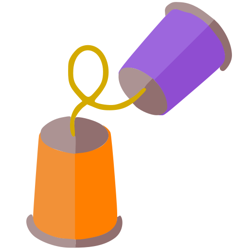
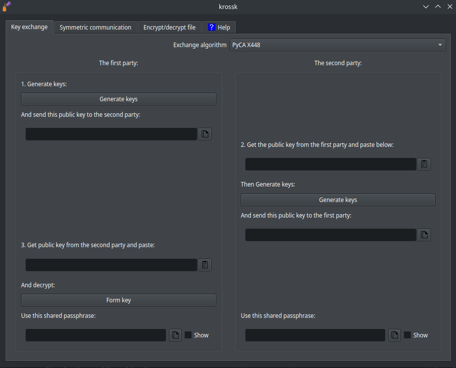
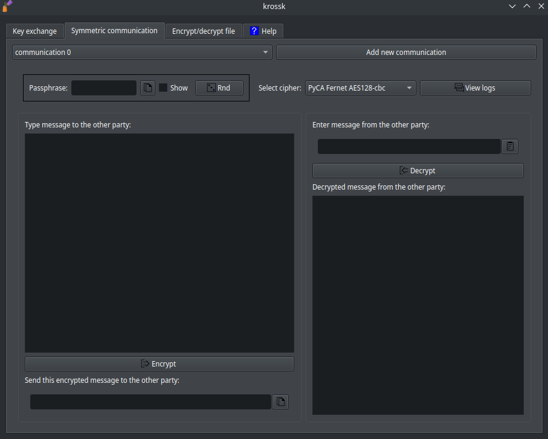
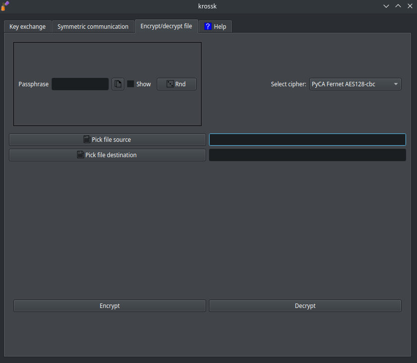

# krossk



Transfer encrypted messages CROSS unsafe messengers. 

# Dependencies

If the [gpg](https://gnupg.org/) functionality will be used, then you need to [install gpg](https://gnupg.org/download/index.html).

- GNU/linux: 

- - Debian-like: `> sudo apt install gnupg`

- - Arch: `> sudo pacman -S gnupg`.

- Windows: [https://gpg4win.org/download.html](https://gpg4win.org/download.html).

Dependencies `Python`:

``` bash
> python -m ensurepip --upgrade # установка pip, если его нет

> pip install --upgrade pip
> pip install -r requirements.txt
```

# Compiling a single executable file

``` bash
> git clone https://github.com/The220th/krossk
> cd krossk
> python -m venv new_venv

> source ./new_venv/bin/activate  # GNU/Linux
> .\new_venv\Scripts\activate.bat # Windows

> pip freeze > requirements_for_delete.txt
> pip uninstall -r requirements_for_delete.txt -y

> pip install --upgrade pip
> pip install -r requirements.txt
> pip install pyinstaller

> pyinstaller --onefile --paths=new_venv/lib64/python3.10/site-packages/:new_venv/lib/python3.10/site-packages/ krossk.py # GNU/Linux
> pyinstaller --onefile --paths=new_venv\Lib\site-packages --windowed krossk.py # Windows

# В директории dist будет лежать исполняемый файл
```

# Launch

Либо скачайте исполняемый файл из [релизов](https://github.com/The220th/krossk/releases) и запустите его. 

Либо:

``` bash
> git clone https://github.com/The220th/krossk
> cd krossk
> pip install -r requirements.txt
> python krossk.py
```

# Usage

Must say that the use of the program is at your own risk.

Example:

Alice and Bob want to exchange messages using some messenger. Moreover, they can exchange messages ONLY through this messenger (they cannot meet in person). Alice and Bob also know that Eve reads their every message. How can Alice and Bob exchange messages so that Eve can't read them? This program will help solve this problem. 

## Вкладка Key exchange



In order for Alice and Bob to encrypt messages, they need a "shared password" or `passphrase`. But passphrase cannot be written to their messenger, since Eva reads everything. Key exchange can be done using asymmetric encryption.

In `krossk`, 2 algorithms `PyCA X448` and `kRSA4096` are presented for this.

- [PyCA X448](https://github.com/pyca/cryptography/blob/main/src/cryptography/hazmat/primitives/asymmetric/x448.py) allows you to exchange keys using `Diffie-Hellman key exchange` method on an elliptical curve 448.

- [kRSA4096](https://github.com/The220th/krossk/blob/main/krossk_crypto/rsa4096.py) is an implementation of RSA, which will also allow you to exchange passphrase.

You can exchange keys on the `Key Exchange` tab. 

The messaging participants (Alice and Bob) are divided into 2 roles:

- `The first party`

- `The second party`

Each participant chooses only 1 role.

The key exchange consists of three points:

1. Key generation by the participant of `The first party`. Sending keys to the participant of `The second party`.

2. Getting the keys from `The first party`. Forming a response by a participant of `The second party`. Sending a response to the participant of `The first party`.

3. Receiving a response from `The second party` and forming a `shared key`. 

In the program, in the `Key exchange` tab, these items are signed as (1, 2, 3). 

Let Alice be `The first party` and Bob be `The second party`. Alice does all the actions on the left side of the window, and Bob does them on the right.

### Пункт 1

Alice presses the `Generate keys` button.

Alice copies the created public key and sends it to Bob via messenger. 

### Пункт 2

Bob receives the public key from Alice and inserts it into the `Public key` text field.

If kRSA4096 is used, then you need to enter the `passphrase generator`. In such case, you can press the `Rnd` button to make a random one.

Bob presses the button under the public key and sends the received text below to Alice via messenger.

Bob also receives the `shared key` or `passphrase` in the lower right corner. 

### Пункт 3

Alice copies what Bob sent in the second paragraph and inserts it in the third step at the bottom.

Next, Alice presses the Form key button and receives a `shared key` or `passphrase` in the lower left corner.

If everything is done correctly, then Alice and Bob will have the same `passphrase`. This identical passphrase will need to be used in the `Symmetric communication` tab.

Try to assume both roles first (`The first party` and `The second party`) and exchange passphrase with yourself. 

Eva has read all the messages, but she can't do anything about it (due to asymmetric encryption). The only way for Eve to "hack" the messages is to change Alice's/Bob's keys to her own. This can only be done if Eva can change the messages in the correspondence in the messenger. Such vulnerability is called "man in the middle".

Roughly speaking, if Bob knows for sure that he is texting with Alice, and Alice knows for sure that she is texting with Bob, and at the same time Eve cannot change their correspondence, then the "man in the middle" is not to be feared of. 

There are `copy/paste` buttons next to each data/key/passphrase entry field. You can also copy using `CTRL+C`, pre-selecting the entire text using the `CTRL+A` keyboard shortcut. You can paste the copied text using `CTRL+V`. 

## Вкладка Symmetric communication



This is where message encryption takes place. 

Enter the `passphrase` received in the `Key exchange` tab. The other side of the communication should have the same `passphrase`. 

`The communication side` meaning the person with whom encrypted messages are exchanged.

If the `passphrase` was negotiated in advance, for example, during a personal meeting, then enter this pre-negotiated `passphrase`. It is important that the `passphrase` is the same for both communication parties.

In the window on the top right, in the drop-down menu, you can select the symmetric encryption algorithm. There are 4 options available:

- [PyCA Fernet AES128-cbc](https://github.com/pyca/cryptography/blob/main/src/cryptography/fernet.py).

- [GPG AES256](https://dev.gnupg.org/source/gnupg/).

- [GPG Default](https://dev.gnupg.org/source/gnupg/).

- [kaes256CBC](https://github.com/The220th/py_AES256_cbc_implementation/blob/main/kaes256cipher.py).

Additions:

* [Fernet](https://github.com/fernet/spec/).

* `GPG AES256` and `GPG default` differ only in the parameter `--s2k-cipher-algo`. In `GPG AES256` it is equal to `AES256`, and in `GPG default` it is empty. `GPG` needs to be installed separately.
There may be encoding issues on Windows.

The `View logs` button allows you to see the history of encrypted/decrypted messages. If no messages have been encrypted/decrypted yet, the logs ("correspondence") will be empty. All data is deleted after the program is closed. Therefore, you will need to save it manually if necessary. 

To encrypt a message to the other party, write a message in the large text field on the left and click the `Encrypt` button. The encrypted string will appear below the `Encrypt` button, which you need to send to the other party via messenger. To copy the characters, press the copy button to the right or use `CTRL+A`, `CTRL+C`. 

After you receive the encrypted string from the other party, copy them and paste in the text field `Enter message from the other party` on the right side of the window. To paste, use `CTRL+V` or click the paste button to the right of the window. Next, click `Decrypt`. Now, the decrypted message from the first party will appear in the large text field below. 

You can encrypt messages sequentially with different symmetric encryption algorithms. 

To view all encrypted and decrypted messages or logs ("correspondence"), use the `View logs` button.

Above the `View logs` button, there is an `Add new communication` button to add a new environment. You can switch between them using the drop-down list to the left of the `Add new communication` button. In each new environment, you can set different symmetric encryption algorithms. Also, each new environment will have its own logs ("correspondence"). Every new environment is needed for every new side of communication. 

For training, you can take on the role of all sides of communication and encrypt/decrypt your own message to yourself. 

## Вкладка Encrypt/decrypt file



This is where file encryption takes place. 

Enter `passphrase`. This is the password with which you can encrypt and decrypt the file.

Select the encryption algorithm. There are 4 options available in `krossk`:

- [PyCA Fernet AES128-cbc](https://github.com/pyca/cryptography/blob/main/src/cryptography/fernet.py).

- [GPG AES256](https://dev.gnupg.org/source/gnupg/).

- [GPG Default](https://dev.gnupg.org/source/gnupg/).

- [kaes256CBC](https://github.com/The220th/py_AES256_cbc_implementation/blob/main/kaes256cipher.py).

Additions:

* [Fernet](https://github.com/fernet/spec/).

* `GPG AES256` and `GPG default` differ only in the parameter `--s2k-cipher-algo`. In `GPG AES256` it is equal to `AES256`, and in `GPG default` it is empty. `GPG` needs to be installed separately.
There may be encoding issues on Windows.

* `kaes256CBC` will run very slowly. Encrypt small files with it.

After selecting the file to encrypt (and where to save it), click the `Encrypt` or `Decrypt` button. 

Now the encrypted file can be sent in an insecure messenger. 

You can also encrypt using multiple encryption algorithms, changing the `passphrase` between them. 
